<picture>
  <source media="(prefers-color-scheme: dark)" srcset="banner.svg">
  <source media="(prefers-color-scheme: light)" srcset="banner-light.svg">
  
</picture>

## 👨‍💻 About Me

I'm a B.Tech AI student exploring how intelligent systems are built.

My interests currently revolve around:

• Computer Vision
• AI Engineering
• Full-Stack Development
• Open Source Learning

I'm focused on learning deeply, building consistently, and understanding the engineering behind modern software systems.

 
 
 

## 🎯 Current Focus

My current mission is **Building Intelligent Systems**. I'm heavily focused on exploring cutting-edge AI technologies, deepening my knowledge in Web Development with JavaScript, and contributing to open-source projects. 

 

## 🌍 Visitor Globe

 

## 📈 Coding Activity Graph

 

## 📊 GitHub Stats & Top Languages

  
  

 

## 💬 Favorite Quote

 

## 🐍 Contribution Snake

<picture>
  <source media="(prefers-color-scheme: dark)" srcset="https://raw.githubusercontent.com/krishnapaliwal8791/krishnapaliwal8791/output/github-contribution-grid-snake-dark.svg">
  <source media="(prefers-color-scheme: light)" srcset="https://raw.githubusercontent.com/krishnapaliwal8791/krishnapaliwal8791/output/github-contribution-grid-snake.svg">
  
</picture>

 

## 🏆 GitHub Trophies

 

## 🔗 Connect With Me

  
  
  

